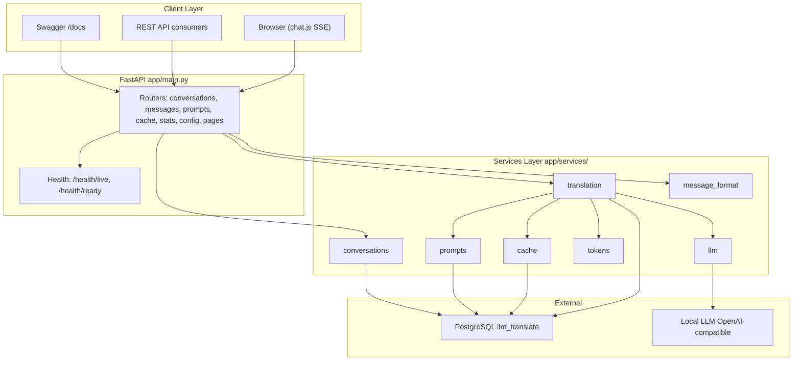
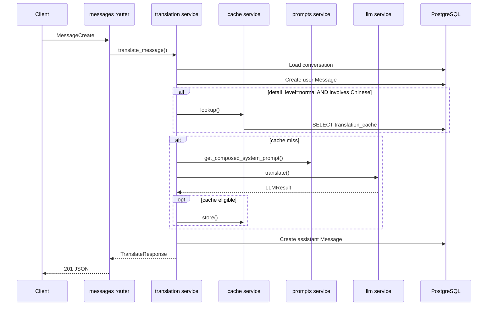

# LLM Translate — เอกสารโปรเจกต์

เว็บบริการแปลภาษาแบบสนทนา (English, 中文, ไทย) ใช้ Local LLM ผ่าน OpenAI-compatible API

---

## Tech Stack

| Layer | เทคโนโลยี |
|-------|-----------|
| Runtime | Python 3.11+ |
| Web framework | FastAPI + Uvicorn |
| ORM / DB | SQLAlchemy 2.0 (async) + asyncpg |
| Database | PostgreSQL 16, schema `llm_translate` |
| Migrations | Alembic (async, schema-scoped version table) |
| LLM client | OpenAI Python SDK (`AsyncOpenAI`) |
| Token counting | tiktoken (`cl100k_base`) |
| Config | pydantic-settings (`.env` + env vars) |
| UI | Jinja2 templates + vanilla JavaScript (fetch + SSE) |
| HTTP client (health) | httpx |
| Containers | Docker (Python 3.11-slim) |

---

## สถาปัตยกรรม



**Layering:** Routers รับ HTTP request, validate ด้วย Pydantic schemas, inject DB session ผ่าน `get_db` Business logic อยู่ใน `app/services/` SQLAlchemy models map ไปยัง schema `llm_translate`

---

## โครงสร้างโฟลเดอร์

```
LLM-Translate/
├── app/
│   ├── main.py                 # FastAPI app, lifespan, health, router mounts
│   ├── config.py               # Settings (pydantic-settings)
│   ├── database.py             # Async engine, session, schema bootstrap
│   ├── models/                 # SQLAlchemy ORM
│   │   ├── conversation.py
│   │   ├── message.py
│   │   ├── prompt.py
│   │   ├── translation_cache.py
│   │   └── app_config.py
│   ├── schemas/                # Pydantic request/response models
│   ├── routers/                # HTTP endpoints
│   │   ├── conversations.py
│   │   ├── messages.py         # Translate + SSE stream
│   │   ├── prompts.py
│   │   ├── cache.py
│   │   ├── stats.py
│   │   ├── config_api.py
│   │   └── pages.py            # SSR: /chat, /conversations
│   ├── services/               # Business logic
│   │   ├── translation.py      # Core translate orchestration
│   │   ├── llm.py              # OpenAI-compatible client
│   │   ├── cache.py            # Translation cache + eviction
│   │   ├── conversations.py
│   │   ├── prompts.py
│   │   ├── tokens.py
│   │   └── message_format.py
│   ├── templates/              # Jinja2 HTML
│   └── static/
│       ├── chat.js             # SSE streaming UI
│       └── style.css
├── alembic/                    # Database migrations
├── docker/
├── scripts/
├── Docs/
│   ├── project.md              # เอกสารนี้
│   ├── api.md                  # คู่มือ REST/SSE API
│   └── init.sql                # SQL เริ่มต้นระบบใหม่
├── Dockerfile
├── docker-compose.yml          # Postgres dev stack
├── docker-compose.web.yml      # Web-only deployment
└── README.md
```

---

## Data Flow — การแปล

### Non-streaming (`POST /api/conversations/{id}/messages`)



### Streaming (`POST /api/conversations/{id}/messages/stream`)

Logic เดียวกับ non-streaming แต่:

1. ใช้ **DB session แยก** ต่อ phase (user message commit → stream → assistant save) เพื่อไม่ hold connection ระหว่างรอ LLM
2. ส่ง SSE events: `started` → `user_message` → `token` (deltas) → `done`
3. Trim output แบบ incremental ระหว่าง streaming เพื่อจำกัด Option 3+ และ repetitive tails
4. Cache hit ส่ง `token` event เดียวพร้อมข้อความเต็ม

### รูปแบบ prompt ที่ส่ง LLM

**User content:**
```
Translate from {source_lang} to {target_lang}:
{content}
```

**System prompt:** รวม `system` + `instruction` + `persona` จาก DB (หรือ `.env` defaults) อาจเพิ่ม override สำหรับ `short` / `detailed`

### Detail levels

| Level | คำอธิบาย | ใช้ cache |
|-------|----------|-----------|
| `normal` | ค่าเริ่มต้น — แปลแบบมาตรฐาน | ใช่ (ถ้ามีภาษาจีน) |
| `short` | แปลสั้นกว่า | ไม่ |
| `detailed` | แปลละเอียดกว่า | ไม่ |

### Translation cache

- ใช้เฉพาะเมื่อ `detail_level == "normal"` **และ** `source_lang == "zh"` หรือ `target_lang == "zh"`
- Lookup แบบ exact match บน `(source_text, source_lang, target_lang)`
- LRU eviction เมื่อเกิน `CACHE_MAX_ENTRIES` (default 10,000) ลบ batch ละ `CACHE_EVICTION_BATCH` (500)

---

## Database Schema

ทุกตารางอยู่ใน PostgreSQL schema **`llm_translate`** (config ได้ผ่าน `DB_SCHEMA`)

### `conversations`

| Column | Type | Notes |
|--------|------|-------|
| `id` | UUID PK | Auto-generated |
| `title` | VARCHAR(255) | Nullable; auto-set จากข้อความแรก (80 ตัวอักษร) |
| `default_source_lang` | VARCHAR(2) | Default `zh` |
| `default_target_lang` | VARCHAR(2) | Default `en` |
| `created_at`, `updated_at` | TIMESTAMPTZ | Auto-managed |

**Relationships:** One-to-many `messages` (CASCADE delete)

### `messages`

| Column | Type | Notes |
|--------|------|-------|
| `id` | UUID PK | |
| `conversation_id` | UUID FK | Indexed |
| `role` | ENUM | `user` \| `assistant` |
| `content` | TEXT | ข้อความต้นทาง (user) หรือคำแปล (assistant) |
| `source_lang`, `target_lang` | VARCHAR(2) | `en`, `zh`, `th` |
| `detail_level` | VARCHAR(16) | `normal` \| `short` \| `detailed` |
| `tokens_in`, `tokens_out` | INTEGER | |
| `latency_ms` | INTEGER | 0 สำหรับ cache hit |
| `tokens_per_sec_in/out` | FLOAT | 0 สำหรับ cache hit |
| `from_cache` | BOOLEAN | |
| `created_at` | TIMESTAMPTZ | |

### `translation_cache`

| Column | Type | Notes |
|--------|------|-------|
| `id` | UUID PK | |
| `source_text`, `translated_text` | TEXT | |
| `source_lang`, `target_lang` | VARCHAR(2) | |
| `hit_count` | INTEGER | |
| `created_at`, `last_used_at` | TIMESTAMPTZ | LRU ใช้ `last_used_at` |

**Unique constraint:** `(source_text, source_lang, target_lang)`

### `prompts`

| Column | Type | Notes |
|--------|------|-------|
| `id` | UUID PK | |
| `prompt_type` | ENUM | `system` \| `instruction` \| `persona` (unique) |
| `content` | TEXT | |
| `updated_at` | TIMESTAMPTZ | |

### `app_config`

| Column | Type | Notes |
|--------|------|-------|
| `key` | VARCHAR(128) PK | Generic key-value store |
| `value` | TEXT | มี API แต่ยังไม่ wired เข้า core services |

### Migrations

| Migration | ไฟล์ | การเปลี่ยนแปลง |
|-----------|------|----------------|
| `001` | `alembic/versions/001_initial_schema.py` | สร้าง schema + ตารางทั้งหมด |
| `002` | `alembic/versions/002_add_message_detail_level.py` | เพิ่ม `messages.detail_level` |

- Version table อยู่ที่ `llm_translate.alembic_version`
- `scripts/migrate.py` (Docker entrypoint): ถ้ามีตารางแต่ไม่มี `alembic_version` จะ **stamp head** แทน re-run DDL
- [init.sql](init.sql) — สคริปต SQL สำหรับ**เริ่มต้นระบบใหม่** (PostgreSQL ว่าง); ระบบที่มีข้อมูลแล้วใช้ Alembic

---

## Services Layer

| Service | หน้าที่ |
|---------|---------|
| `translation.py` | Orchestrate แปล, trim output, streaming, บันทึก metrics |
| `llm.py` | OpenAI-compatible client, semaphore จำกัด concurrent calls, timeout |
| `cache.py` | Exact match lookup/store, LRU eviction |
| `prompts.py` | Compose system+instruction+persona, seed defaults, in-memory cache |
| `tokens.py` | tiktoken counting, tokens/sec calculation |
| `message_format.py` | Parse `Option 1:` / `Option 2:` สำหรับ HTML UI |
| `conversations.py` | โหลด conversation + messages ล่าสุด |

---

## Configuration

### Environment variables

| กลุ่ม | ตัวแปร | คำอธิบาย |
|-------|--------|----------|
| Database | `DATABASE_URL` | PostgreSQL async URL |
| | `DB_SCHEMA` | Schema name (default: `llm_translate`) |
| | `DB_POOL_SIZE`, `DB_MAX_OVERFLOW`, `DB_POOL_RECYCLE` | Connection pool |
| LLM | `LLM_BASE_URL` | OpenAI-compatible endpoint |
| | `LLM_API_KEY`, `LLM_MODEL` | API key และชื่อ model |
| | `LLM_TEMPERATURE`, `LLM_MAX_TOKENS` | พารามิเตอร์ generation |
| | `LLM_TIMEOUT_SEC`, `LLM_MAX_CONCURRENT` | Timeout และ concurrency limit |
| Cache | `CACHE_MAX_ENTRIES`, `CACHE_EVICTION_BATCH` | ขนาด cache และ batch eviction |
| App | `APP_HOST`, `APP_PORT`, `APP_DEBUG`, `APP_ENV` | Server settings |
| | `LOG_LEVEL`, `MESSAGE_MAX_LENGTH`, `SSE_PAD_BYTES` | Logging และ limits |
| Prompts | `DEFAULT_SYSTEM_PROMPT`, `DEFAULT_INSTRUCTION_PROMPT`, `DEFAULT_PERSONA_PROMPT` | Fallback เมื่อ DB ว่าง |

ดูรายละเอียดใน `.env.example`

### Docker remapping

เมื่อรันใน container (`/.dockerenv` มีอยู่) `localhost` / `127.0.0.1` ใน `DATABASE_URL` จะถูก remap เป็น `host.docker.internal` อัตโนมัติ

---

## Docker

| ไฟล์ | หน้าที่ |
|------|---------|
| `docker-compose.yml` | **Postgres only** — `postgres:16-alpine`, port 5432 |
| `docker-compose.web.yml` | **Web service only** — build app image, map port 8000 |
| `Dockerfile` | Python 3.11-slim, CRLF-safe entrypoint |
| `docker/entrypoint.sh` | Remap DB host → migrate → uvicorn |

**Design:** Database และ web **แยกกัน** — production DB อยู่ภายนอก; web container ต้องชี้ `DATABASE_URL` ไป Postgres ที่เข้าถึงได้

**Startup sequence (container):**

1. Remap `DATABASE_URL` host ถ้าจำเป็น
2. รัน migrations (`scripts/migrate.py` → `alembic upgrade head` หรือ `stamp head`)
3. Uvicorn serve `app.main:app`
4. Lifespan: `ensure_schema()`, seed/warm prompts

**Health checks:**

- Liveness: `GET /health/live`
- Readiness: `GET /health/ready` — probe DB (`SELECT 1`) และ LLM (`GET {LLM_BASE_URL}/models`)

---

## Design Decisions

1. **Dedicated PostgreSQL schema** — `llm_translate` แยกตาราง app; `search_path` ตั้งทุก connection
2. **Local-first LLM** — ไม่พึ่ง cloud; OpenAI SDK เป็น adapter บน Ollama-compatible endpoints
3. **Chinese-focused cache** — Exact-match cache เฉพาะคู่ที่มีภาษาจีน + `normal` detail
4. **Dual translation options** — System prompts กำหนด `Option 1:` / `Option 2:`; UI parse และ render copyable blocks
5. **Output guardrails** — `_trim_unbounded_output()` ป้องกัน model runaway (extra options, repetitive tails)
6. **Concurrency control** — Semaphore บน LLM calls ป้องกัน overload local inference
7. **Separate streaming sessions** — เปิด/ปิด DB session รอบ LLM I/O ป้องกัน connection pool exhaustion
8. **SSE anti-buffering** — Comment padding (`SSE_PAD_BYTES`) + `X-Accel-Buffering: no`
9. **No authentication** — Public conversations by design; เหมาะ internal/trusted networks
10. **Prompt layering** — System + instruction + persona compose runtime; DB override env defaults
11. **Observability built-in** — Token counts, latency, tokens/sec, cache flag ต่อ message; aggregate ที่ `/api/stats`
12. **Migration safety** — `migrate.py` stamp head เมื่อ legacy DB มีตารางแต่ไม่มี Alembic version row

---

## หมายเหตุสำหรับนักพัฒนา

- UI ใช้ **vanilla JS + fetch + SSE** (`app/static/chat.js`) — ไม่ใช่ HTMX
- SSR form fallback อยู่ที่ `POST /chat/{id}/send` แต่หน้า chat หลักใช้ streaming API
- `app_config` table มี API scaffold แต่ยังไม่ wired เข้า translation หรือ LLM config
- Default prompts ใน `config.py` อาจ skew ไปทาง Chinese→English UAV/aviation; `.env.example` ใช้ generic prompts

---

## เอกสารที่เกี่ยวข้อง

- [api.md](api.md) — คู่มือ REST/SSE API ครบทุก endpoint
- [README.md](../README.md) — ติดตั้งและเริ่มต้นใช้งาน
- `/docs` — Swagger UI (interactive)
